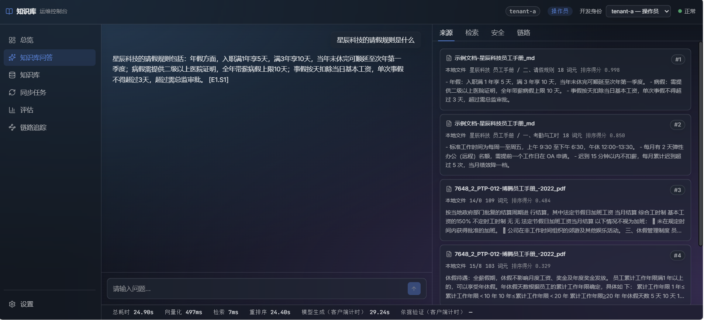
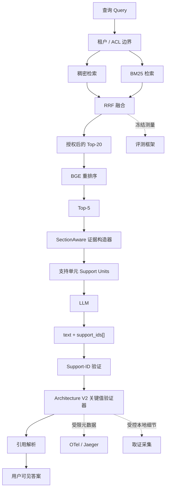

# Knowledge Base RAG

**简体中文** | [English](./README_en.md)

---
一个面向生产风格的多语言 RAG 平台，具备安全的租户边界、混合检索、明确的证据溯源、确定性验证、隐私安全的可观测性以及可复现的评测体系。

**Python** · **FastAPI** · **Qdrant** · **DeepSeek / Ollama** · **React** ·
**OpenTelemetry** · **pytest**

Knowledge Base RAG 是一个本地优先（local-first）的多语言知识库工程作品集系统。它围绕一个大多数 RAG Demo 都会忽略的实际问题进行设计：**当检索到的证据、模型生成的陈述、引用以及关键字面值彼此不一致时，系统应该怎么办？**



## 为什么要做这个项目

仅仅提高检索质量，并不能保证答案可信。一个真正有用的系统必须能够维持租户边界，有意识地构造证据，说明哪些支持单元（support unit）真正送入了模型，验证模型引用的内容，并且当无法建立安全边界时采用“失败即关闭（fail closed）”策略。

本项目将这些边界显式化。同时，它也把评测视为一种工程控制机制：**只有当某项改动通过了在结果产生之前就已经冻结的决策规则时，才会被系统采纳。**

## 它有什么不同

这个系统并不只是“上传 PDF → 搜索向量 → 调用 LLM”，而是进一步实现了：

- 使用倒数排名融合（Reciprocal Rank Fusion, RRF）融合稠密检索与稀疏检索；
- 在重排序或生成之前，由服务端执行租户与角色授权；
- 使用带请求作用域支持单元 ID 的 SectionAware 证据构造机制；
- 对支持身份以及关键字面值一致性进行确定性验证；
- 针对否定、纠正性陈述、有符号数值、版本和重复同级值，采用冻结的“出现位置账本（occurrence ledger）”架构；
- 使用受限的 OpenTelemetry / Jaeger 信号，并支持受控的本地取证采集；
- 提供一个能够区分检索、证据、生成、验证、引用和安全失败的评测框架。

## 工程亮点

| 工程问题 | 系统解决方式 |
| --- | --- |
| 跨租户检索 | 在重排序和生成之前强制执行服务端持有的 ACL。 |
| 有引用并不等于有依据 | 使用请求作用域的 support ID，将“来源可追溯性”与“语义正确性”分离。 |
| RAG 失败难以诊断 | 将失败拆分为：检索 → 重排序 → 证据 → 生成 → 验证 → 引用归因。 |
| 关键值存在歧义 | 通过不可变的 occurrence ledger，使角色判断局限在每一次具体出现位置上。 |
| 基准测试驱动调参存在风险 | 使用冻结数据集、哈希、预注册门槛，并保留被否决的实验。 |

## 关键结果

### 端到端评测

下面的核心指标来自规范的 TechQA BGE-ON 评测记录。这些是**基准测试结果**，并不代表真实客户流量或通用线上服务性能。

| 指标 | 结果 | 含义 |
| --- | ---: | --- |
| 候选证据召回率 | **95.9%** | 所需证据通常能够在候选集合中被找到。 |
| 有用答案率 | **70%** | Correct + Partial；这**不是**准确率。 |
| 实质性错误答案 | **2%** | 对用户可见、错误或具有实质误导性的答案。 |
| 不可用 / 拒答 | **28%** | 没有发布有用且有证据支持的答案；该比例同时包含模型主动拒答和确定性强制拒答。 |
| 严格完全正确 | **30%** | 单独的完整性严格评分，比“有用答案率”更严格。 |

70% 的“有用答案率”是 Correct + Partial，并不是准确率。30% 则是一个独立的严格完整性指标，而不是另一个结果类别。

| 拒答方式 | 结果 | 含义 |
| --- | ---: | --- |
| 模型主动拒答 | 18% (9/50) | 生成器主动拒绝给出缺乏证据支持的答案。 |
| 确定性强制拒答 | 10% (5/50) | 运行时验证阻止了可见答案的发布。 |

当系统无法建立充分支持时，28% 的“不可用”结果是有意设计的 fail-closed 行为。一次拒答并不自动意味着安全成功，也不自动意味着质量失败；它是否合适，需要在单个案例层面单独判断。
候选证据召回率是在更早的检索边界上测量的，因此这里不会用它来判断某个具体拒答是否合理。拒答是否恰当，与仓库其他部分一样，通过分层失败归因视角进行评估。

### 重排序器选择基准

[冻结的重排序器选择基准](docs/reranking.md)包含 220 个多语言问题，使用 Recall@5、平均倒数排名（MRR）以及归一化折损累计增益 nDCG@5 来评估检索 / 排序质量。它与上面的最终答案评测相互独立。

| 配置 | TR→EN Recall@5 | EN→TR Recall@5 | Cross MRR | Cross nDCG@5 |
| --- | ---: | ---: | ---: | ---: |
| 混合检索，不使用 reranker | 0.9259 | 0.9867 | 0.7448 | 0.7988 |
| 原有英文 reranker | 0.2222 | 0.6800 | 0.3670 | 0.3880 |
| 多语言 BGE | **1.0000** | **1.0000** | **0.9558** | **0.9672** |

在这份冻结基准上，`BAAI/bge-reranker-v2-m3` 在 TR→EN 与 EN→TR 两个切片上都达到了 1.0000 的 Recall@5，同时 Cross MRR 为 0.9558，Cross nDCG@5 为 0.9672。这些是检索 / 排序指标，并不是最终答案准确率。

当时要回答的问题是：**多语言检索应该使用哪一个 reranker？** 多语言模型明显优于此前的英文 reranker。之后又进行了一个独立实验，用于判断是否可以完全移除 reranking。该实验预先注册的“语义不退化门槛”没有通过，因此没有批准移除 reranking。
因此，“选择 BGE 替代英文 reranker”和“保留 `BGE_REMOVAL_NOT_SUPPORTED`”并不矛盾。

### 安全性证据

在修正后的 TechQA 评测中，support-ID 与 citation 合约没有接受任何未知、跨查询、隐藏或未授权的 support ID，同时引用合约失败次数为 0：

| 安全检查 | 观测结果 |
| --- | ---: |
| 被接受的未知 / 跨查询 / 隐藏 / 未授权 support ID | **0** |
| 引用合约失败 | **0** |

这些是基于评测语料得到的确定性合约结果，并不意味着系统安全已经获得形式化证明。

禁用 BGE 会显著提高证据完整性，但两个实验分支之间并没有发现稳健、方向明确的语义优势。由于预先注册的语义不退化门槛仍然没有通过，因此没有批准移除 BGE（`BGE_REMOVAL_NOT_SUPPORTED`）。相关证据与评分定义见[规范评测报告](artifacts/ragbench/canonical/techqa-reranker-corrected-holdout-execution-v2/)。

## 架构



运行时从已经认证的 `UserContext` 和服务端持有的租户 ACL 开始；未授权候选不会进入重排序或生成阶段。FastAPI 负责认证、授权、检索、生成、SSE 以及引用解析。Qdrant 提供当前生效的索引。React Operations Console 用于展示最终证据和 trace 状态，但它**不是授权边界**。

## 当前检索与证据流程

一次问答不会把向量检索返回的原始 chunk 直接交给 DeepSeek，而是依次经过以下阶段：

1. Qwen3-Embedding-4B 通过 Ollama 生成查询向量；Qdrant 同时执行稠密检索与 BM25 稀疏检索。
2. Qdrant 使用 RRF 融合两路候选，然后由 `BAAI/bge-reranker-v2-m3` 对候选重新排序。Markdown 的标题路径会与正文一起参与重排序，降低不同文档中相似正文互相干扰的概率。
3. 当 `RAG_PIPELINE_V2=true` 或 `SUPPORT_IDS_ENABLED=true` 时，`SectionAwareEvidenceBuilder` 会继续处理重排后的 Top-N chunk。它按照租户、来源、文档版本以及逻辑 section 分组，而不是把同一文件的全部结果合并到一个大块中。
4. Markdown 使用标题路径和标题出现序号作为 section 边界；PDF 没有稳定标题路径时，以物理页码作为最小边界。同一请求可以生成多个 evidence block，多份 PDF 或 Markdown 也会分别保留来源边界。
5. Builder 只在锚点所属的同一页或同一标题 section 内补充相邻 chunk，并受 `PIPELINE_V2_CONTEXT_TOKEN_BUDGET` 控制。最终 block 再拆成请求作用域的 support units，交给 DeepSeek 生成带 `support_ids` 的结构化答案。
6. 应用层验证 support ID、关键字面值和引用关系；证据不足时返回中文拒答，模型格式或校验异常时返回单独的中文错误，避免把程序错误误报为“知识库没有资料”。

前端“来源”面板展示的是 **Builder 生成后、实际发送给模型的 evidence block**，不是最初的原始 chunk。这保证了用户看到的证据与模型收到的上下文一致。

### “词元”显示说明

入库阶段的 token-aware chunking 使用 Qwen tokenizer 计算真实模型 token；但当前 evidence block 的 `token_count` 使用空白字符切分进行快速估算。英文通常接近单词数，中文因为句子内部没有空格会被明显低估。因此来源卡片中的“18 词元”不表示正文只有 18 个真实模型 token，也不表示 Block Builder 没有运行。

该估算值目前同时用于 evidence context budget，应把它理解为 **block 阶段的近似预算单位**，而不是 Qwen 或 DeepSeek 的精确 token 数。若要严格控制中文长文档上下文，后续应让 Builder 复用 token-aware chunking 的 tokenizer。

## 失败归因

当一个答案失败时，有用的问题不只是“答案错了吗？”，还应该问“**它最先在哪一层开始出错？**”。运行时与评测记录会明确区分这些失败类别：

```text
检索遗漏
  → reranker 丢失相关证据
  → 证据打包损失
  → 生成错误
  → 验证器过度拒绝
  → 引用失败
```

目标是找出**第一个应该负责的系统边界**，而不是简单给最终结果打“通过 / 失败”标签。这样就可以针对真正的问题层进行改进，而不是用验证器指标掩盖检索局限，或者把“引用身份检查”误称为“语义 grounding”。

<a id="architecture-v2-occurrence-aware-validation"></a>
## 架构 V2：面向出现位置（Occurrence-Aware）的验证

### 为什么验证器要使用 Occurrence Ledger

早期验证器原型陆续加入了对否定、纠正性陈述、有符号数值、版本以及同值同级项的处理。持续出现的失败暴露了一个结构性问题：在提取、数值匹配、mask 处理以及文本重新发现之间，**身份信息丢失了**。
一个值可能会重新关联到错误角色，或者某个带符号数值内部的无符号值会被错误地当作一个独立出现位置。

旧流程是：

```text
提取 → 数值/类型匹配 → 文本重新发现 → masking → 再次提取 → 验证
```

冻结后的 Architecture V2 流程是：

```text
一次规范化提取
  → 不可变 occurrence ledger
  → 面向每个 occurrence 的局部角色分类
  → 结构化 VALIDATE 过滤
  → 冻结的 V3 数值语义
```

例如：

> 带符号的结果是 -204，而不是 204。

概念上的 ledger 会让身份始终绑定到具体 occurrence：

```text
O1: -204  → VALIDATE
O2:  204  → SKIP_REJECTED_PREMISE
```

`-204` 内部的 `204` 不会再次被独立发现。这体现了一个更一般的设计原则：**角色判断属于具体出现位置，而不是属于全局归一化后的数值。**

Architecture V2 被冻结为
`CRITICAL_VALUE_VALIDATOR_ARCHITECTURE_V2_09d94bb7c9d1`，并且是当前作品集运行时的默认验证器。Baseline 与 V3 仍作为显式的服务端选项保留，以便回滚和比较。实现与独立验证证据可在
[Architecture V2 工件](artifacts/ragbench/canonical/critical-value-validator-architecture-v2-implementation-v1/)
以及[独立验证 V2](artifacts/ragbench/canonical/critical-value-validator-architecture-v2-independent-contract-validation-v2/)中查看。

## 安全边界

系统有意将下面三个问题分离：

1. **支持身份与来源（Support identity and provenance）：** support-ID 验证用于证明被引用的 support unit 确实存在、已获授权，并且模型可见。
2. **关键字面值一致性（Critical literal consistency）：** Architecture V2 对数字、单位、版本、日期、百分比和标识符等值执行确定性一致性检查。
3. **语义答案质量（Semantic answer quality）：** 通过离线评测判断答案是否真的基于证据满足了用户问题。

Support-ID 验证**不能**证明语义蕴含关系。关键值验证也**不能**解决一般意义上的语义 grounding 问题。将这些能力边界区分开，可以让运行时行为与评测结果都更容易被准确分析。

## 评测理念

> **只有当一个结果通过了在结果已知之前就冻结的决策规则时，它才会改变系统。**

| 实验 | 得到的结论 | 决策 |
| --- | --- | --- |
| 移除 BGE | 禁用 BGE 显著提高了证据完整性，但预注册的语义不退化门槛仍未通过。 | 保留 BGE；`BGE_REMOVAL_NOT_SUPPORTED`。 |
| Validator V1 | 指标变好也不足以抵消 locale-safety 硬门槛失败。 | 否决候选方案。 |
| Validator V4/V5/V6 | 持续增加极性和 masking 补丁，仍不断暴露 occurrence 身份问题。 | 停止打补丁，重新设计合约。 |
| Architecture V2 | 新的独立合约验证和运行时集成通过，同时保持身份与隐私门槛不被破坏。 | 集成 occurrence-ledger 架构。 |

被否决的路径仍然以规范证据的形式保存在仓库中，而不是被重写成“成功故事”。历史上的 V1 标注缺陷及其 `FAILED` 判定也被保留；之后的独立 V2 验证是一个单独的新结果。

## 运行状态

Architecture V2 是当前作品集运行时的默认验证器。该路径已经通过真实的本地浏览器 → API → RAG → validator → telemetry 流程验证，其中包括直接 Chrome CDP 控制、引用解析和故障隔离。

该仓库实现了面向生产的控制机制，但它本质上仍是一个**作品集系统**，并不声称自己正在运行真正面向客户的生产服务。项目没有声称存在真实客户流量、生产 SLO、已完成的生产 canary 或生产推广流程。Architecture V2 shadow 默认关闭。

## 功能特性

### 检索

- 使用 Qwen3-Embedding-4B，并配置 1024 维索引。
- 使用 Qdrant 进行稠密检索和 BM25 稀疏检索，再通过 RRF 融合。
- 在经过授权的候选上使用 BAAI/bge-reranker-v2-m3 进行重排序，并把 Markdown 标题路径加入重排序文本。
- 在受限上下文预算内进行 SectionAware 证据打包；PDF 按页、Markdown 按标题 section 分组，并允许一次查询产生多个 block。

### Grounding 与安全

- 在重排序或生成之前强制执行租户 ACL 和角色边界。
- 使用请求作用域 support unit，并由应用层负责引用解析。
- 使用冻结的 Architecture V2 occurrence ledger，并对基础设施故障采用 fail-closed 处理。
- 对不可信上下文进行序列化，并采用严格的缓冲验证模式。

### 评测

- 冻结评测总体、预注册、哈希、scorecard 和决策记录。
- 区分 strict、useful、materially incorrect 与 unavailable 等不同结果。
- 对 retrieval / evidence / generation / validator / citation 进行分层失败归因。
- 对安全关键型验证器行为执行独立合约验证。

### 可观测性

- 使用 OpenTelemetry traces，并通过 Jaeger 检查聊天与同步流程。
- 只记录受限的架构、结果、角色数量、耗时和错误元数据。
- 常规 telemetry 中不记录原始 query、answer、evidence、literal、prompt 或 credential。
- 可通过受控本地 forensic capture 执行 occurrence 级诊断。

### 运行时

- FastAPI 后端与 React RAG Operations Console。
- 基于 Qdrant 的索引生命周期，支持 alias 激活和可感知回滚的同步。
- 使用 DeepSeek 进行答案生成，通过硅基流动托管 Qwen3 embedding 和 BGE reranker。
- 使用 OpenAI 兼容的结构化输出协议调用 DeepSeek；格式异常会自动重试一次，并与“证据不足”使用不同的中文提示。
- 使用 SSE 交付答案，并由应用层解析引用；前端会跨网络分片保留完整事件，避免 `sources` 与 `data` 被拆包后丢失。

## 快速开始

### 前置条件

- Python 3.11+
- Docker Desktop 或兼容的 Docker Engine
- Node.js 22 与 npm
- 用于答案生成的 DeepSeek API Key
- 用于 embedding 和 reranker 的硅基流动 API Key

### 本地运行

```bash
cp .env.example .env

# 启动后端之前，请先在 .env 中设置 DEEPSEEK_API_KEY 和 SILICONFLOW_API_KEY。

docker compose up -d --build

cd frontend
npm ci
npm run dev
```

`docker compose` 必须在包含 `docker-compose.yml` 的项目目录中执行。`--build` 会根据当前目录中的 Compose 配置和 `Dockerfile` 重新构建后端镜像，并替换同一 Compose 项目下的 backend 容器；Python 依赖已经在镜像构建阶段安装。默认容器不再下载或加载本地稠密 embedding/reranker 模型（BM25 稀疏编码仍由 Qdrant/FastEmbed 路径提供）。

只修改 `data/documents` 中的文档通常不需要重建镜像，重新同步知识库即可。修改 Python 后端、依赖或 Dockerfile 后执行 `docker compose up -d --build backend`；修改 React 前端后重新启动或构建前端。

如需在宿主机恢复本地重排序，先执行 `pip install -r requirements-reranker-local.txt`，再设置 `RERANKER_BACKEND=sentence-transformers`。默认服务器镜像不包含这组重量级可选依赖。

复制后的环境会默认启用基于证据的 support-unit 流程：
`RAG_PIPELINE_V2=true`、`SUPPORT_IDS_ENABLED=true` 和
`CRITICAL_VALIDATOR_VERSION=architecture_v2`。
打开 Vite 输出的前端地址，通常为 `http://localhost:5173`。
Compose 后端通常运行在 `http://localhost:8000`，Qdrant 运行在 `6333` 端口，Jaeger 运行在 `16686` 端口。
全新安装后必须先导入文档，检索才能返回证据。具有 operator 身份的用户可以从控制台或受保护的 sync API 触发同步。

如果希望在宿主机原生开发后端，可运行 `docker compose up -d qdrant jaeger`，然后执行 `make dev`，并单独启动前端。包括认证和 CORS 设置在内的完整环境变量说明见 [`.env.example`](.env.example)。

## 配置

所有 validator 的选择都由服务端控制。query、header、cookie、body 字段或前端偏好都不能选择 validator。

| 配置项 | 作品集默认值 | 用途 |
| --- | --- | --- |
| `RAG_PIPELINE_V2` | `true` | 默认使用基于证据构造的作品集流程。 |
| `SUPPORT_IDS_ENABLED` | `true` | 默认输出 support unit，并由应用层完成 support 验证。 |
| `PIPELINE_V2_CONTEXT_TOKEN_BUDGET` | `1200` | SectionAware Builder 的全局 evidence block 预算；当前 block 阶段为近似词元计数。 |
| `CHUNKING_MODE` | `baseline`（应用默认） | 设置为 `token_aware` 后按真实 tokenizer 分块；当前 Docker 工作配置使用 `token_aware`。 |
| `CHUNK_TARGET_TOKENS` | `512` | token-aware 分块的目标大小。 |
| `CHUNK_OVERLAP_TOKENS` | `64` | 相邻 token-aware chunk 的目标重叠大小。 |
| `CHUNK_HARD_MAX_TOKENS` | `576` | 单个 token-aware chunk 的硬上限。 |
| `CRITICAL_VALIDATOR_VERSION` | `architecture_v2` | 可选 `baseline`、`v3` 或 `architecture_v2`。 |
| `CRITICAL_VALIDATOR_ARCH_V2_SHADOW_ENABLED` | `false` | V2 诊断 shadow；默认关闭。 |
| `CRITICAL_VALIDATOR_V3_SHADOW_ENABLED` | `false` | 可选的 V3 诊断 shadow。 |
| `GENERATION_PROVIDER` / 模型设置 | DeepSeek / `deepseek-v4-flash` | 通过兼容 OpenAI 的 API 进行远程答案生成。 |
| `EMBEDDING_PROVIDER` / `EMBEDDING_MODEL_KEY` | SiliconFlow / `qwen3-4b` | 通过硅基流动生成 1024 维 embedding，并使用对应的 Qdrant 索引。 |
| `RERANKER_BACKEND` / `RERANKER_MODEL` | SiliconFlow / `BAAI/bge-reranker-v2-m3` | 通过硅基流动 API 重排序，不在后端加载本地 CrossEncoder。 |
| `RAG_FORENSIC_CAPTURE_ENABLED` | `false` | 启用受控本地元数据取证采集。 |
| `RAG_FORENSIC_CAPTURE_RAW_TEXT` | `false` | 记录原始取证文本；永远不会进入常规 OTel。 |

非法的 validator 选择会触发 fail-closed。若要显式比较或回滚，可以将 `CRITICAL_VALIDATOR_VERSION` 设置为 `baseline` 或 `v3`；不需要迁移数据库、Qdrant、索引、embedding 或文档。

## 可观测性与取证

常规 trace 只包含受限元数据，例如 validator 版本、结果、原因类别、occurrence 与 role 数量、耗时、强制拒答状态和 shadow 状态。它不会包含原始用户内容或逐 occurrence ID。
正常 telemetry 始终保持数据量受限且不包含内容；更深层的 occurrence 级诊断需要显式启用受控的本地 forensic capture。

启用受控本地 forensic capture 后，产物可以暴露 occurrence ledger、角色判断、过滤后的 `VALIDATE` ID 以及冻结 V3 委派结果。这样可以提供调试路径，而不需要把生产 telemetry 变成内容存储。
建议从 [Architecture V2 rollout 说明](docs/critical-validator-architecture-v2-rollout.md) 和[本地 shadow-ready 证据](artifacts/ragbench/canonical/critical-value-validator-architecture-v2-shadow-readiness-v2/)开始查看。

## 测试

确定性后端测试套件是默认验证路径，不会调用外部 provider：

```bash
pytest -m "not ollama_e2e"
ruff check app tests scripts
```

最近一次冻结的运行时 checkpoint 记录为：**1245 passed、1 skipped、6 deselected**。随着可复用测试增加，这些数量可能继续变化。依赖 provider 的检查会显式执行：

```bash
pytest -m "ollama_e2e"
```

修改 UI 时，可运行前端检查：

```bash
cd frontend
npm test
npm run typecheck
npm run lint
npm run build
```

## 可复现证据

规范化 artifact 树会保留预注册信息、冻结总体、源码哈希、scorecard、运行时报告和决策记录。它们用于为工程决策提供证据，而不能替代上面的简洁系统说明。

推荐入口：

- [Architecture V2 实现](artifacts/ragbench/canonical/critical-value-validator-architecture-v2-implementation-v1/)
- [独立合约验证 V1](artifacts/ragbench/canonical/critical-value-validator-architecture-v2-independent-contract-validation-v1/)
- [独立合约验证 V2](artifacts/ragbench/canonical/critical-value-validator-architecture-v2-independent-contract-validation-v2/)
- [生产集成审查](artifacts/ragbench/canonical/critical-value-validator-architecture-v2-production-integration-review-v1/)
- [Shadow readiness V2](artifacts/ragbench/canonical/critical-value-validator-architecture-v2-shadow-readiness-v2/)
- [规范 RAGBench 索引](artifacts/ragbench/canonical/)

## 评审快速路径

如果要进行一次 10 分钟技术审查：

1. 先查看架构图以及[架构 V2：面向出现位置的验证](#architecture-v2-occurrence-aware-validation)。
2. 阅读[系统架构](docs/architecture.md)和[安全边界](docs/security.md)。
3. 查看 [Architecture V2 adapter](app/evaluation/critical_validator_architecture_v2.py)、[occurrence ledger](app/evaluation/critical_occurrences.py) 和[role classifier](app/evaluation/critical_roles.py)。
4. 阅读可复用的[集成合约测试](tests/test_critical_validator_architecture_v2_integration.py)。
5. 阅读一份[规范 TechQA 报告](artifacts/ragbench/canonical/techqa-reranker-corrected-holdout-execution-v2/)。
6. 在本地运行 UI，在 Jaeger 中检查一条 trace，并将简洁的 [rollout 说明](docs/critical-validator-architecture-v2-rollout.md) 与保留下来的规范证据进行对照。

## 局限性

- 严格完全正确率仍低于有用答案率。
- 保守拒答是一个有意为之的安全取舍，并不意味着 answerability 问题已经解决。
- BGE reranking 在低延迟敏感服务中被测得成本较高；由于移除门槛没有通过，因此仍然保留该模型。
- 确定性 validator 无法建立任意语义蕴含关系。
- T4 布尔归一化与 T6 单位等价仍属于两个独立、尚未解决的机制类别，并未被纳入 Architecture V2 激活范围。
- 当前 benchmark 语料对于区分更大的、token-aware 的 chunk 边界来说仍然偏短。
- Evidence block 的词元数仍采用空白切分估算，会明显低估中文文本；它不等于 Qwen/DeepSeek tokenizer 的真实 token 数。
- 本地 / Demo 认证并不等同于完整的面向客户生产环境身份设计。
- 本项目不声称存在真实客户生产流量、生产 SLO、在线 canary 或生产推广。

## 路线图

- SectionAware 多 section 不变量审计。
- 更好的失败归因仪表盘。
- BGE serving、microbatching 或自适应 reranking 实验。
- 使用更长文档和更多多语言案例扩展 benchmark 语料。
- 面向语义完整性的 evaluator / final-evidence 对齐工作。

## 深入文档

- [系统架构](docs/architecture.md)
- [安全模型](docs/security.md)
- [Reranking 决策](docs/reranking.md)
- [Chunking 决策](docs/chunking.md)
- [评测语料设计](docs/evaluation-dataset.md)
- [架构决策](docs/adr/README.md)
- [工程历史](docs/PLANNING.md)

## 许可证

分发条款请参阅仓库中的许可证与相关声明。
