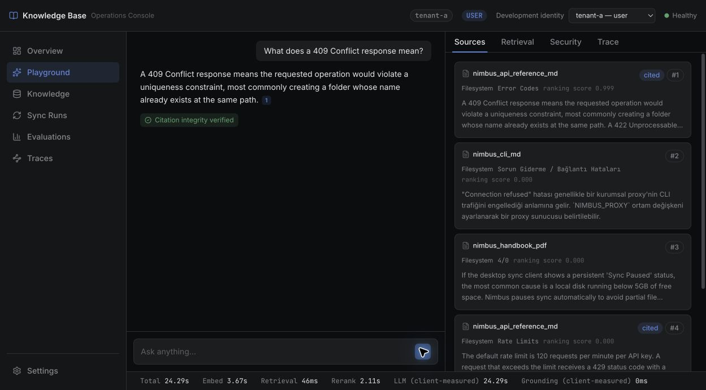
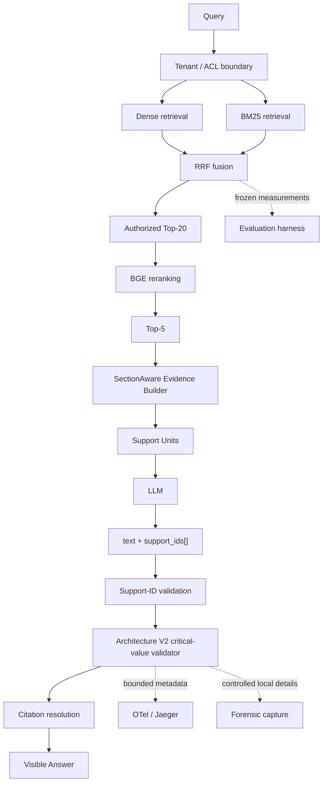

# Knowledge Base RAG

[简体中文](./README.md) | **English**

---

Production-style multilingual RAG platform with secure tenant boundaries,
hybrid retrieval, explicit evidence provenance, deterministic validation,
privacy-safe observability, and reproducible evaluation.

**Python** · **FastAPI** · **Qdrant** · **DeepSeek / Ollama** · **React** ·
**OpenTelemetry** · **pytest**

Knowledge Base RAG is a local-first engineering portfolio system for
multilingual knowledge bases. It is designed around a practical question that
most RAG demos skip: what should happen when retrieved evidence, generated
claims, citations, and critical literals do not agree?



## Why This Project Exists

Retrieval quality alone does not make an answer trustworthy. A useful system
must preserve tenant boundaries, construct evidence deliberately, explain
which support units reached the model, validate the model's references, and
fail closed when a safety boundary cannot be established.

This project makes those boundaries explicit. It also treats evaluation as an
engineering control: a change is adopted only when it passes a decision rule
that was frozen before the result was known.

## What Makes It Different

The system goes beyond “upload a PDF, search vectors, call an LLM” with:

- dense and sparse retrieval fused with reciprocal rank fusion;
- server-owned tenant and role authorization before reranking or generation;
- SectionAware evidence construction with request-scoped support-unit IDs;
- deterministic validation of support identity and critical literal consistency;
- a frozen occurrence-ledger architecture for negation, corrections, signed
  values, versions, and repeated siblings;
- bounded OpenTelemetry/Jaeger signals plus controlled local forensic capture;
- an evaluation harness that separates retrieval, evidence, generation,
  validation, citation, and security failures.

## Engineering Highlights

| Engineering problem | System response |
| --- | --- |
| Cross-tenant retrieval | Server-owned ACL is enforced before reranking and generation. |
| Citation is not grounding | Request-scoped support IDs separate provenance from semantic correctness. |
| RAG failures are hard to diagnose | Retrieval → reranking → evidence → generation → validation → citation attribution. |
| Critical-value ambiguity | An immutable occurrence ledger keeps role decisions local to each occurrence. |
| Benchmark-driven tuning risk | Frozen datasets, hashes, preregistered gates, and preserved rejected experiments. |

## Key Results

### End-to-End Evaluation

The headline numbers below are from the canonical TechQA BGE-ON evaluation
record. They are benchmark results, not claims about live customer traffic or
general serving performance.

| Metric | Result | Interpretation |
| --- | ---: | --- |
| Candidate evidence recall | **95.9%** | Required evidence was usually found in the candidate set. |
| Useful-answer rate | **70%** | Correct + Partial; this is not an accuracy claim. |
| Materially incorrect answers | **2%** | Wrong or materially misleading visible answers. |
| Unavailable / abstained | **28%** | No useful supported answer was released; this combines model self-abstention and deterministic forced abstention. |
| Strict fully-correct | **30%** | Separate full-completeness scoring, stricter than useful-answer rate. |

The 70% useful-answer rate is Correct + Partial, not accuracy. The 30% result
is a separate strict full-completeness metric rather than another outcome bucket.

| Abstention mode | Result | Meaning |
| --- | ---: | --- |
| Model self-abstain | 18% (9/50) | The generator declined to provide a supported answer. |
| Deterministic forced abstain | 10% (5/50) | Runtime validation prevented release of a visible answer. |

The 28% unavailable outcome is an intentional fail-closed behavior when support
cannot be established. An abstention is not automatically a safety success or a
quality failure; whether it was appropriate is a separate case-level question.
Candidate evidence recall is measured at an earlier retrieval boundary and is
not used here to classify the appropriateness of individual abstentions.
Appropriateness is evaluated through the same layer-wise failure-attribution
view used elsewhere in this repository.

### Reranker Selection Benchmark

The [frozen reranker selection benchmark](docs/reranking.md) contains 220
multilingual questions and measures retrieval/ranking quality with Recall@5,
Mean Reciprocal Rank (MRR), and normalized Discounted Cumulative Gain at 5
(nDCG@5). It is separate from the final-answer evaluation above.

| Configuration | TR→EN Recall@5 | EN→TR Recall@5 | Cross MRR | Cross nDCG@5 |
| --- | ---: | ---: | ---: | ---: |
| Hybrid retrieval, no reranker | 0.9259 | 0.9867 | 0.7448 | 0.7988 |
| Existing English reranker | 0.2222 | 0.6800 | 0.3670 | 0.3880 |
| Multilingual BGE | **1.0000** | **1.0000** | **0.9558** | **0.9672** |

On this frozen benchmark, `BAAI/bge-reranker-v2-m3` reached Recall@5 of 1.0000
in both TR→EN and EN→TR slices, with Cross MRR 0.9558 and Cross nDCG@5
0.9672. These are retrieval/ranking metrics, not final-answer accuracy.

The selection question was which reranker should serve multilingual retrieval;
the multilingual model materially outperformed the prior English reranker. A
later, separate experiment asked whether reranking could be removed entirely.
Its preregistered semantic non-regression gate failed, so removal was not
authorized. There is no contradiction between selecting BGE over the English
reranker and retaining `BGE_REMOVAL_NOT_SUPPORTED`.

### Safety Evidence

Within the corrected TechQA evaluation, the support-ID and citation contracts
accepted no unknown, cross-query, hidden, or unauthorized support IDs, and had
zero citation contract failures:

| Safety check | Observed |
| --- | ---: |
| Unknown / cross-query / hidden / unauthorized support IDs accepted | **0** |
| Citation contract failures | **0** |

These are deterministic contract results from the evaluated corpus, not a
claim of formally proven system security.

Disabling BGE materially improved evidence completeness, but no robust
directional semantic advantage was distinguishable between the arms. Because
the preregistered semantic non-regression gate still failed, removal was not
authorized (`BGE_REMOVAL_NOT_SUPPORTED`). See the
[canonical evaluation report](artifacts/ragbench/canonical/techqa-reranker-corrected-holdout-execution-v2/)
for the evidence and score definitions.

## Architecture



The runtime starts with an authenticated `UserContext` and server-owned tenant
ACL; unauthorized candidates never reach reranking or generation. FastAPI
owns authentication, authorization, retrieval, generation, SSE, and citation
resolution. Qdrant serves the active index. The React Operations Console
presents the resulting evidence and trace state; it is not an authorization
boundary.

## Current Retrieval and Evidence Flow

A question is not answered by sending raw vector-search chunks directly to
DeepSeek. The runtime executes these stages instead:

1. Qwen3-Embedding-4B generates the query embedding through Ollama, while
   Qdrant runs dense and BM25 sparse retrieval.
2. Qdrant fuses both branches with RRF, then
   `BAAI/bge-reranker-v2-m3` reranks the candidates. Markdown heading paths are
   included in the reranker input to reduce interference between similar body
   text from different documents.
3. When `RAG_PIPELINE_V2=true` or `SUPPORT_IDS_ENABLED=true`,
   `SectionAwareEvidenceBuilder` processes the reranked Top-N chunks. It groups
   them by tenant, source, document version, and logical section instead of
   merging every result from the same file into one oversized block.
4. Markdown uses heading path plus heading occurrence as the section boundary.
   PDF content falls back to physical page number when no stable heading path
   exists. One request can therefore produce multiple evidence blocks, and
   multiple PDF or Markdown files retain independent source boundaries.
5. The builder expands only within the anchor's page or heading section and
   remains bounded by `PIPELINE_V2_CONTEXT_TOKEN_BUDGET`. Final blocks are then
   projected into request-scoped support units and sent to DeepSeek under the
   structured `support_ids` contract.
6. The application validates support IDs, critical literals, and citation
   ownership. Insufficient evidence produces the Chinese abstention message;
   malformed model output or validation failure produces a separate Chinese
   error so an execution problem is not misreported as missing knowledge.

The frontend Sources panel displays the **post-builder evidence blocks actually
sent to the model**, not the initial raw retrieval chunks. This keeps visible
evidence aligned with model-visible context.

### Token Count Display

Token-aware ingestion uses the Qwen tokenizer for real model-token counts.
However, the current evidence-block `token_count` is a fast whitespace-based
estimate. It is usually close to an English word count but substantially
undercounts Chinese text because Chinese sentences contain few spaces. A source
card showing “18 tokens” therefore does not mean the content contains only 18
Qwen/DeepSeek tokens, and it does not mean the Block Builder was skipped.

The same estimate currently feeds the evidence context budget, so it should be
treated as an **approximate block-stage budget unit**, not an exact tokenizer
measurement. Strict context control for long Chinese documents should make the
builder reuse the token-aware chunking tokenizer in a future change.

## Failure Attribution

When an answer fails, the useful question is not only “was it wrong?” but “at
which boundary did it become wrong?” The runtime and evaluation records keep
these classes distinct:

```text
retrieval miss
  → reranker loss
  → evidence-packing loss
  → generation error
  → validator over-rejection
  → citation failure
```

The goal is to identify the first responsible system boundary, not merely to
assign a final pass/fail label. This makes it possible to improve the right
layer without hiding a retrieval limitation behind a validator metric or
calling a citation identity check semantic grounding.

## Architecture V2: Occurrence-Aware Validation

### Why the Validator Uses an Occurrence Ledger

Earlier validator prototypes added handling for negation, corrective claims,
signed values, versions, and same-value siblings. Repeated failures exposed a
structural problem: identity was lost between extraction, value matching,
masking, and text re-discovery. A value could be rejoined with the wrong role
or an inner unsigned value could be counted as an independent occurrence.

The old shape was:

```text
extract → value/type matching → text rediscovery → masking → re-extraction → validate
```

The frozen Architecture V2 shape is:

```text
one canonical extraction
  → immutable occurrence ledger
  → occurrence-local role classification
  → structured VALIDATE filter
  → frozen V3 value semantics
```

For example:

> The signed result is -204, not 204.

The conceptual ledger keeps identity attached to each occurrence:

```text
O1: -204  → VALIDATE
O2:  204  → SKIP_REJECTED_PREMISE
```

The `204` inside `-204` is not independently rediscovered. This is a small
example of the larger design principle: role decisions belong to occurrences,
not to globally normalized values.

Architecture V2 is frozen under
`CRITICAL_VALUE_VALIDATOR_ARCHITECTURE_V2_09d94bb7c9d1` and is the default
validator in this portfolio runtime. Baseline and V3 remain explicit
server-side options for rollback and comparison. The implementation and
independent evidence are available in the
[Architecture V2 artifacts](artifacts/ragbench/canonical/critical-value-validator-architecture-v2-implementation-v1/)
and [independent validation V2](artifacts/ragbench/canonical/critical-value-validator-architecture-v2-independent-contract-validation-v2/).

## Safety Boundaries

The system deliberately separates three questions:

1. **Support identity and provenance:** support-ID validation proves that a
   cited support unit existed, was authorized, and was visible to the model.
2. **Critical literal consistency:** Architecture V2 checks deterministic
   consistency for values such as numbers, units, versions, dates, percentages,
   and identifiers.
3. **Semantic answer quality:** offline evaluation determines whether the
   answer actually fulfills the question from the evidence.

Support-ID validation does **not** prove semantic entailment. Critical-value
validation does **not** solve general semantic grounding. Keeping those claims
separate makes both the runtime behavior and the evaluation results easier to
reason about.

## Evaluation Philosophy

> A result changes the system only if it passes a decision rule frozen before
> the result is known.

| Experiment | What it taught us | Decision |
| --- | --- | --- |
| BGE removal | Disabling BGE materially improved evidence completeness, but the preregistered semantic non-regression gate still failed. | Keep BGE; `BGE_REMOVAL_NOT_SUPPORTED`. |
| Validator V1 | Improved metrics did not compensate for a locale-safety hard-gate failure. | Reject the candidate. |
| Validator V4/V5/V6 | Incremental polarity and masking fixes kept exposing occurrence-identity failures. | Stop patching; redesign the contract. |
| Architecture V2 | Fresh independent contract validation and runtime integration passed with identity and privacy gates intact. | Integrate the occurrence-ledger architecture. |

The rejected paths remain available as canonical evidence rather than being
rewritten into a success narrative. The historical V1 annotation defect and
its `FAILED` verdict are preserved; the later independent V2 validation is a
separate result.

## Runtime Status

Architecture V2 is the default validator in this portfolio runtime. The path
has been verified through a real local browser → API → RAG → validator →
telemetry flow, including direct Chrome CDP control, citation resolution, and
failure isolation.

This repository implements production-oriented controls, but it is a portfolio
system rather than a claim of operating a customer-facing production service.
There is no claim of live customer traffic, production SLOs, a completed
production canary, or a production promotion exercise. Architecture V2 shadow
is off by default.

## Features

### Retrieval

- Qwen3-Embedding-4B embeddings with the configured 1024-dimensional index.
- Qdrant dense and BM25 sparse retrieval with reciprocal rank fusion.
- BAAI/bge-reranker-v2-m3 over authorized candidates, with Markdown heading
  paths included in reranker text.
- SectionAware evidence packing under a bounded context budget, grouped by PDF
  page or Markdown heading section and capable of producing multiple blocks.

### Grounding and Safety

- Mandatory tenant ACL and role boundaries before reranking or generation.
- Request-scoped support units and application-owned citation resolution.
- Frozen Architecture V2 occurrence ledger with fail-closed infrastructure
  handling.
- Untrusted context serialization and strict buffered validation mode.

### Evaluation

- Frozen populations, preregistration, hashes, scorecards, and decision records.
- Separate strict, useful, materially incorrect, and unavailable outcomes.
- Retrieval/evidence/generation/validator/citation failure attribution.
- Independent contract validation for safety-critical validator behavior.

### Observability

- OpenTelemetry traces with Jaeger inspection for chat and sync flows.
- Bounded architecture, outcome, role-count, duration, and error metadata.
- No raw query, answer, evidence, literal, prompt, or credential in normal
  telemetry.
- Controlled local forensic capture for occurrence-level diagnosis.

### Runtime

- FastAPI backend and React RAG Operations Console.
- Qdrant-backed index lifecycle with alias activation and rollback-aware sync.
- DeepSeek answer generation with Ollama-hosted Qwen3 embeddings.
- DeepSeek through an OpenAI-compatible structured-output contract, with one
  retry for malformed output and distinct Chinese messages for insufficient
  evidence versus execution/validation errors.
- SSE answer delivery with application-resolved citations; the frontend keeps
  complete events across network chunks so split `sources`/`data` frames are
  not lost.

## Quickstart

### Prerequisites

- Python 3.11+
- Docker Desktop or a compatible Docker Engine
- Node.js 22 and npm
- Native [Ollama](https://ollama.com) for local embeddings
- A DeepSeek API key for answer generation

### Run locally

```bash
cp .env.example .env
ollama pull qwen3-embedding:4b

# Set DEEPSEEK_API_KEY in .env before starting the backend.

docker compose up -d --build

cd frontend
npm ci
npm run dev
```

Run `docker compose` from the project directory containing
`docker-compose.yml`. `--build` uses that Compose file and the local
`Dockerfile` to rebuild the backend image and replace the backend container in
the same Compose project. Python dependencies are installed while the image is
built. Ollama remains native on the host and is not installed in the backend
container.

Changing files under `data/documents` normally requires only a knowledge-base
sync, not an image rebuild. After Python backend, dependency, or Dockerfile
changes, run `docker compose up -d --build backend`. Restart or rebuild the
React frontend after frontend changes.

The copied environment enables the default evidence-backed support-unit path:
`RAG_PIPELINE_V2=true`, `SUPPORT_IDS_ENABLED=true`, and
`CRITICAL_VALIDATOR_VERSION=architecture_v2`. Open the frontend URL printed by
Vite, normally `http://localhost:5173`.
The compose backend normally serves on `http://localhost:8000`, Qdrant on
`6333`, and Jaeger on `16686`. A fresh installation must ingest documents
before retrieval can return evidence. An operator identity can trigger sync
from the console or the protected sync API.

For host-native backend development, run `docker compose up -d qdrant jaeger`,
then use `make dev` and run the frontend separately. The full environment
surface, including auth and CORS settings, is documented in
[`.env.example`](.env.example).

## Configuration

All validator selection is server-controlled. A query, header, cookie, body
field, or frontend preference cannot select a validator.

| Setting | Portfolio default | Purpose |
| --- | --- | --- |
| `RAG_PIPELINE_V2` | `true` | Default portfolio path for evidence-backed construction. |
| `SUPPORT_IDS_ENABLED` | `true` | Default support-unit output and application-owned support validation. |
| `PIPELINE_V2_CONTEXT_TOKEN_BUDGET` | `1200` | Global SectionAware evidence-block budget; block-stage counting is currently approximate. |
| `CHUNKING_MODE` | `baseline` (application default) | Set to `token_aware` for tokenizer-based chunking; the current Docker working profile uses `token_aware`. |
| `CHUNK_TARGET_TOKENS` | `512` | Target size for token-aware chunks. |
| `CHUNK_OVERLAP_TOKENS` | `64` | Target overlap between adjacent token-aware chunks. |
| `CHUNK_HARD_MAX_TOKENS` | `576` | Hard maximum for one token-aware chunk. |
| `CRITICAL_VALIDATOR_VERSION` | `architecture_v2` | `baseline`, `v3`, or `architecture_v2`. |
| `CRITICAL_VALIDATOR_ARCH_V2_SHADOW_ENABLED` | `false` | Diagnostic V2 shadow; off by default. |
| `CRITICAL_VALIDATOR_V3_SHADOW_ENABLED` | `false` | Optional diagnostic V3 shadow. |
| `GENERATION_PROVIDER` / model settings | DeepSeek / `deepseek-v4-flash` | Remote answer generation over the OpenAI-compatible API. |
| `EMBEDDING_MODEL_KEY` | `qwen3-4b` | Local embeddings through Ollama, with a 1024-dimensional Qdrant index. |
| `RAG_FORENSIC_CAPTURE_ENABLED` | `false` | Controlled local metadata capture. |
| `RAG_FORENSIC_CAPTURE_RAW_TEXT` | `false` | Raw forensic text; never normal OTel. |

Invalid validator selectors fail closed. To compare or roll back explicitly,
set `CRITICAL_VALIDATOR_VERSION=baseline` or `v3`; no database, Qdrant,
reindexing, embedding, or document migration is required.

## Observability and Forensics

The normal trace contains bounded metadata such as validator version, outcome,
reason class, occurrence and role counts, duration, forced-abstain state, and
shadow status. It does not contain raw user content or per-occurrence IDs.
Normal telemetry stays bounded and content-free; deeper occurrence-level
diagnostics require explicit controlled local forensic capture.

When controlled local forensic capture is enabled, the artifact can expose the
occurrence ledger, role decisions, filtered `VALIDATE` IDs, and frozen V3
delegation result. This provides a debugging path without turning production
telemetry into a content store. Start with the
[Architecture V2 rollout note](docs/critical-validator-architecture-v2-rollout.md)
and the [local shadow-readiness evidence](artifacts/ragbench/canonical/critical-value-validator-architecture-v2-shadow-readiness-v2/).

## Testing

The deterministic backend suite is the default verification path and does not
make provider calls:

```bash
pytest -m "not ollama_e2e"
ruff check app tests scripts
```

The latest frozen runtime checkpoint recorded **1245 passed, 1 skipped, and 6
deselected**. Counts may increase as reusable tests are added. Provider-backed
checks are explicit:

```bash
pytest -m "ollama_e2e"
```

Frontend checks are available when the UI changes:

```bash
cd frontend
npm test
npm run typecheck
npm run lint
npm run build
```

## Reproducible Evidence

The canonical artifact tree preserves preregistrations, frozen populations,
source hashes, scorecards, runtime reports, and decision records. It is
evidence for the engineering decisions, not a substitute for the concise
system description above.

Curated entry points:

- [Architecture V2 implementation](artifacts/ragbench/canonical/critical-value-validator-architecture-v2-implementation-v1/)
- [Independent contract validation V1](artifacts/ragbench/canonical/critical-value-validator-architecture-v2-independent-contract-validation-v1/)
- [Independent contract validation V2](artifacts/ragbench/canonical/critical-value-validator-architecture-v2-independent-contract-validation-v2/)
- [Production integration review](artifacts/ragbench/canonical/critical-value-validator-architecture-v2-production-integration-review-v1/)
- [Shadow readiness V2](artifacts/ragbench/canonical/critical-value-validator-architecture-v2-shadow-readiness-v2/)
- [Canonical RAGBench index](artifacts/ragbench/canonical/)

## Reviewer Fast Path

For a 10-minute technical review:

1. Start with the diagram and [Architecture V2: Occurrence-Aware Validation](#architecture-v2-occurrence-aware-validation).
2. Review the [system architecture](docs/architecture.md) and [security boundary](docs/security.md).
3. Inspect the [Architecture V2 adapter](app/evaluation/critical_validator_architecture_v2.py), [occurrence ledger](app/evaluation/critical_occurrences.py), and [role classifier](app/evaluation/critical_roles.py).
4. Read the reusable [integration contract tests](tests/test_critical_validator_architecture_v2_integration.py).
5. Read one [canonical TechQA report](artifacts/ragbench/canonical/techqa-reranker-corrected-holdout-execution-v2/).
6. Run the local UI, inspect a trace in Jaeger, and compare the concise [rollout note](docs/critical-validator-architecture-v2-rollout.md) with the preserved canonical evidence.

## Limitations

- Strict full-completeness remains below the useful-answer rate.
- Conservative abstention is a deliberate safety trade-off, not a solved
  answerability problem.
- BGE reranking is measured as expensive for latency-sensitive serving; the
  removal gate did not pass, so the model remains enabled.
- The deterministic validator does not establish arbitrary semantic
  entailment.
- T4 boolean normalization and T6 unit-equivalence remain separate unresolved
  mechanism classes; they were not folded into Architecture V2 activation.
- The current benchmark corpus is short for distinguishing larger token-aware
  chunk boundaries.
- Evidence-block token counts still use a whitespace estimate and materially
  undercount Chinese text; they are not real Qwen/DeepSeek tokenizer counts.
- Local/demo authentication is not a complete customer-production identity
  design.
- This project makes no claim of real customer production traffic, production
  SLOs, a live canary, or a production promotion.

## Roadmap

- SectionAware multi-section invariant audit.
- Better failure-attribution dashboards.
- BGE serving, microbatching, or adaptive reranking experiments.
- Broader benchmark corpora with longer documents and more multilingual cases.
- Evaluator/final-evidence alignment work for semantic completeness.

## Deeper Documentation

- [System architecture](docs/architecture.md)
- [Security model](docs/security.md)
- [Reranking decision](docs/reranking.md)
- [Chunking decision](docs/chunking.md)
- [Evaluation corpus design](docs/evaluation-dataset.md)
- [Architecture decisions](docs/adr/README.md)
- [Engineering history](docs/PLANNING.md)

## License

See the repository license and notices for distribution terms.
